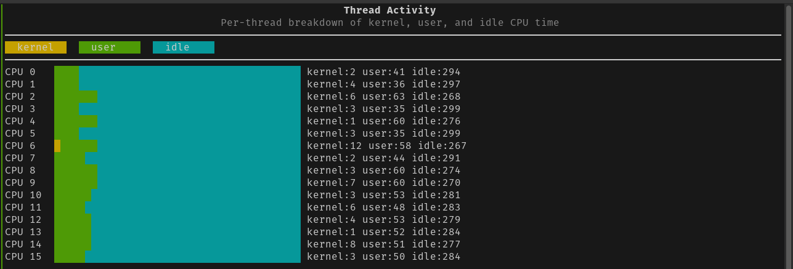
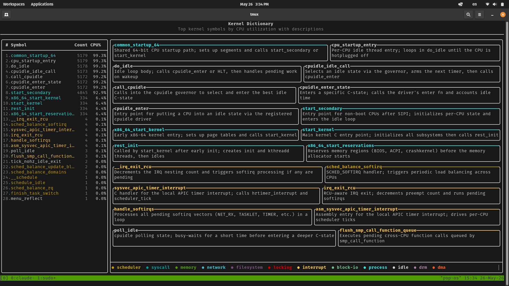

# CPU Profiler

A live eBPF-based CPU profiler designed as an educational tool for understanding what the operating system is really doing while your computer runs. Samples all CPU cores at 99hz, captures kernel and userspace call stacks, and presents the data through a real-time TUI.

Built as a learning exercise for eBPF, Linux internals, C++, and systems performance.

## North Star

A suite of eBPF-based OS observability tools — starting with CPU, with memory profiling to follow. Each instrument uses the same pattern: eBPF collection, real-time aggregation, and a TUI that makes OS internals visible and intuitive.

## Screenshots





## Current Progress

- [x] BPF program sampling all CPUs at 99hz via perf events
- [x] Kernel stack resolution via `/proc/kallsyms`
- [x] Userspace stack resolution via `/proc/PID/maps` (shows file+offset, not yet symbol names)
- [x] CMake build system with FTXUI via FetchContent
- [x] Collector running on background thread
- [x] Double-buffered event pipeline with 3.4s snapshot heartbeat
- [x] TUI with thread activity view (per-CPU kernel/user/idle bar chart)
- [x] Kernel dictionary view: live top-N symbols ranked by CPU%, with descriptions and category color coding
- [x] Symbol descriptions stored in `data/descriptions.json` (483 symbols with categories)
- [x] `collect_symbols` tool to discover new kernel symbols on a running system
- [x] Call stack view: top kernel call chains as proportional colored bars, ranked by frequency

## Live Snapshot

While the profiler is running, [`data/snapshot.json`](data/snapshot.json) is updated after every heartbeat (every ~3.4s) with the last 60 seconds of resolved events. Inspect it with:

```bash
jq '.[0]' data/snapshot.json          # first event
jq '[.[].comm] | unique' data/snapshot.json   # all process names seen
jq '[.[].kernel_syms[]] | group_by(.) | map({sym: .[0], count: length}) | sort_by(-.count) | .[0:10]' data/snapshot.json  # top kernel symbols
```

## Next Steps

- [ ] ELF symbol table parsing for real userspace function names

## Dependencies

```bash
sudo apt install clang libbpf-dev libelf-dev zlib1g-dev bpftool cmake
```

## Build

```bash
mkdir build && cd build
cmake ..
make
```

## Usage

```bash
sudo ./build/profiler
```

## TUI Views

The TUI refreshes every 3.4 seconds. Terminal size determines how much data is shown — a larger window reveals more threads and stack depth, a smaller one filters to only the hottest activity.

- **Thread activity**: per-thread breakdown of time spent in kernel, userspace, and idle
- **Kernel dictionary**: top-20 kernel symbols ranked by CPU utilization, with descriptions and category color coding
- **Call stacks**: top kernel call chains rendered as proportional colored bars, ranked by sample frequency

## Project Structure

```
bpf/                          # BPF kernel program
  profiler.bpf.c              # Samples CPU stacks via perf events at 99hz
  profiler.h                  # Shared structs between kernel and userspace
src/                          # Userspace C++
  main.cpp                    # Entry point, TUI shell, double-buffer heartbeat
  collector.cpp/h             # Loads BPF, manages perf events and ring buffer
  buffer.h                    # Thread-safe double buffer for event snapshots
  symbols.cpp/h               # Resolves kernel and userspace addresses to function names
  output.cpp/h                # Legacy per-event stdout output (to be removed)
  aggregators/
    aggregator.h              # Abstract base class for all views
    thread_activity.cpp/h     # Per-CPU kernel/user/idle bar chart
    kernel_dictionary.cpp/h   # Top kernel symbols ranked by CPU%, with descriptions
    call_stack.cpp/h          # Top kernel call chains as proportional colored bars
data/
  descriptions.json           # 483 kernel symbols with descriptions and categories
tools/
  collect_symbols.cpp         # Samples for 2 minutes and adds new symbols to descriptions.json
CMakeLists.txt                # Build system (CMake + FTXUI + nlohmann/json via FetchContent)
screenshots/                  # Screenshots for README
```

## How We're Building This

See [CLAUDE.md](CLAUDE.md) for instructions to future Claude sessions on how to collaborate on this project.
